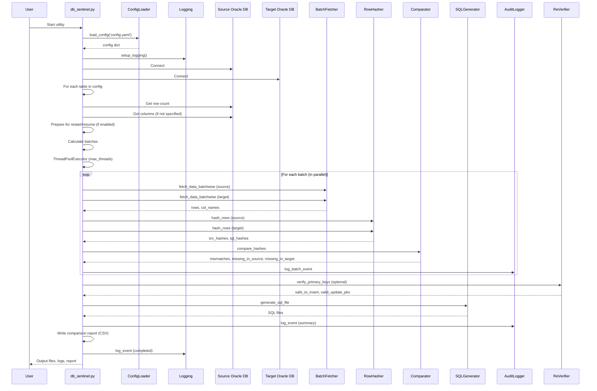

# DB Sentinel Utility – Detailed Sequence Flow

Below is a detailed sequence diagram of the DB Sentinel utility, showing the interactions between the main components during a table comparison and synchronization run. (Note: Mermaid does not support coloring for sequence diagrams, so the legend is for reference only.)

---

## Legend (for reference only)

| Color         | Component/Role         |
|---------------|-----------------------|
| 🟨 Yellow     | User/Config           |
| 🟩 Green      | Main Script           |
| 🟦 Blue       | DB Connections        |
| 🟧 Orange     | Logging/Batch         |
| 🟥 Red        | Hashing               |
| 🟩 Light Green| Comparison            |
| 🟦 Light Blue | Audit Logging         |
| 🟪 Pink       | Reverification        |
| 🟫 Gray Blue  | SQL Generation        |

> Mermaid does not support coloring for sequence diagrams. Use the legend as a reference for roles/components only. 